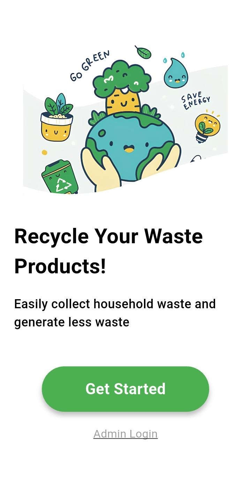
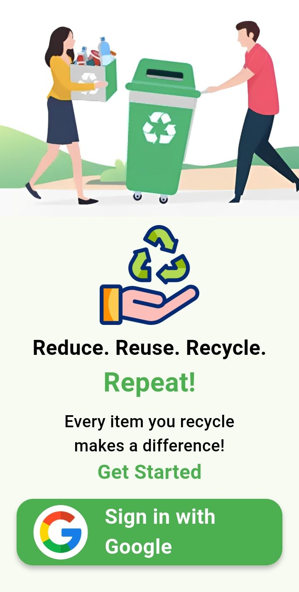
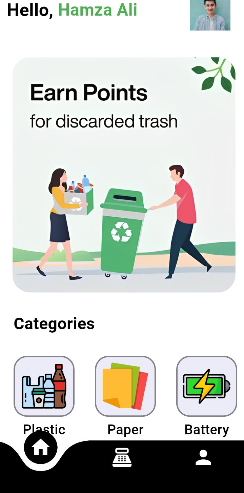
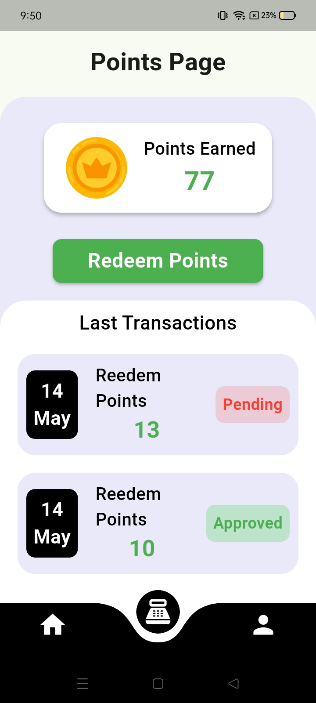
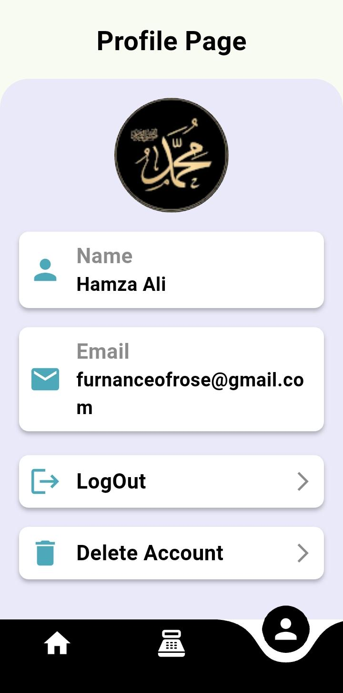

# ♻️ Recycle App — Flutter Mobile Application

A Flutter-based mobile application that encourages users to recycle household waste by rewarding them with points. Users can submit recyclable items, earn points, and redeem them for real money. An admin panel manages item approvals and redemption requests.

---

## 📱 Screenshots

| Splash / Onboarding | Sign In | Home |
|---|---|---|
|  |  |  |

| Points Page | Redeem Approval | Profile |
|---|---|---|
|  |  |  |

---

## ✨ Features

### 👤 User Side
- **Google Sign-In** — Users log in securely with their Google account
- **Home Dashboard** — Personalized greeting with banner and waste category grid (Plastic, Paper, Battery, etc.)
- **Submit Recyclable Items** — Upload items by category to earn points
- **Points System** — Track total points earned in real time
- **Redeem Points** — Request cash redemption via UPI ID
- **Transaction History** — View past redeem requests with Pending / Approved status
- **Profile Page** — View name, email, and manage account (Logout / Delete Account)

### 🛠️ Admin Side
- **Admin Login** — Secure username/password login for admins
- **Item Approvals** — Review and approve user-submitted recycling requests
- **Redeem Requests** — Approve or reject point redemption requests with UPI details

---

## 🏗️ Tech Stack

| Layer | Technology |
|---|---|
| Framework | Flutter (Dart) |
| Backend | Firebase |
| Authentication | Firebase Auth + Google Sign-In |
| Database | Cloud Firestore |
| File Storage | Firebase Storage |
| Local Storage | Shared Preferences |
| UI | Material Design + Curved Navigation Bar |

---

## 📦 Dependencies

```yaml
firebase_core
cloud_firestore
firebase_auth
firebase_storage
google_sign_in: ^6.2.1
image_picker
shared_preferences: ^2.5.5
curved_navigation_bar: ^1.0.6
random_string
intl: ^0.20.2
cupertino_icons: ^1.0.8
```

---

## 🚀 Getting Started

### Prerequisites

- Flutter SDK `^3.11.0`
- Dart SDK
- Android Studio / VS Code
- A Firebase project

### Installation

1. **Clone the repository**
   ```bash
   git clone https://github.com/kamizox/Recycle_Flutter_Mobile_App.git
   cd Recycle_Flutter_Mobile_App
   ```

2. **Install dependencies**
   ```bash
   flutter pub get
   ```

3. **Firebase Setup**
   - Go to [Firebase Console](https://console.firebase.google.com/) and create a new project
   - Enable **Authentication** (Google Sign-In)
   - Enable **Cloud Firestore**
   - Enable **Firebase Storage**
   - Download `google-services.json` and place it in `android/app/`
   - Download `GoogleService-Info.plist` and place it in `ios/Runner/`

4. **Run the app**
   ```bash
   flutter run
   ```

---

## 📂 Project Structure

```
lib/
├── main.dart               # Entry point
├── screens/
│   ├── splash_screen.dart
│   ├── onboarding_screen.dart
│   ├── login_screen.dart
│   ├── home_screen.dart
│   ├── points_screen.dart
│   ├── profile_screen.dart
│   └── admin/
│       ├── admin_login.dart
│       ├── admin_panel.dart
│       ├── item_approvals.dart
│       └── redeem_requests.dart
├── widgets/
└── models/
images/                     # App assets
android/                    # Android platform files
ios/                        # iOS platform files
```

---

## 🔐 Admin Access

Admins log in through a separate **Admin Login** screen (accessible from the onboarding screen). Admin credentials are managed in Firebase.

---

## 🌱 How It Works

1. User signs in with Google
2. User submits recyclable items (photo + category)
3. Admin reviews and approves the submission → Points are added
4. User requests redemption entering their UPI ID
5. Admin approves the redemption → Payment is processed

---

## 🤝 Contributing

Pull requests are welcome! For major changes, please open an issue first to discuss what you'd like to change.

---

## 📄 License

This project is open source and available under the [MIT License](LICENSE).

---

## 👨‍💻 Author

**Hamza Ali**  
[GitHub: @kamizox](https://github.com/kamizox)
